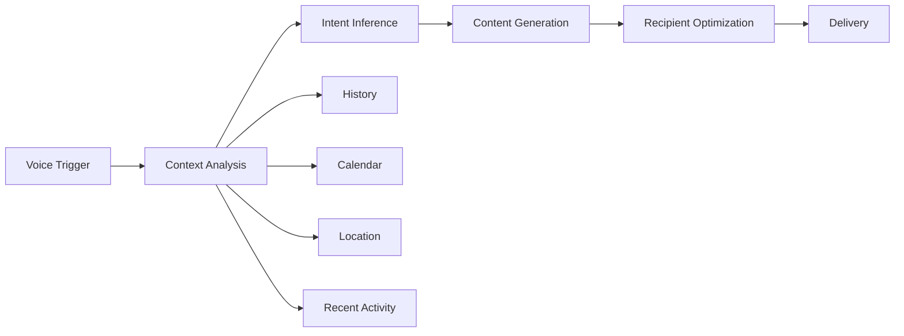

# Blue Ocean Vision: Revolutionary Jott Ecosystem

## Core Insight: The Attention Crisis

**The Problem Space:**
- **Attention Scarcity**: Average human attention span dropped from 12 to 8 seconds
- **Cognitive Overload**: 174 newspapers worth of data consumed daily
- **Communication Mismatch**: Stone-age brains using space-age technology
- **Context Switching Cost**: 23 minutes to refocus after interruption
- **Information Anxiety**: Fear of missing out vs. fear of not keeping up

**Our Revolutionary Response: Jotts as Cognitive Companions**

## The Mind-Reading Jott Experience

### "Jott Now" - Voice-First Cognitive Assistant

```
User: "Jott now"
AI: "Who to?"
User: "Jane"
AI: [Analyzes context] "About the project update?"
User: "Yes"
AI: [Creates Jott in 2 seconds with all relevant context]
```

### How It Works - Anticipatory Intelligence

#### 1. Context Awareness Engine
```typescript
interface CognitiveContext {
  temporal: {
    timeOfDay: TimeContext;        // Morning brief vs evening summary
    dayOfWeek: DayContext;         // Monday planning vs Friday wrap-up
    deadline: DeadlineProximity;   // Urgency detection
  };

  behavioral: {
    recentTopics: Topic[];          // What you've been working on
    communicationPatterns: Pattern[]; // Who you talk to about what
    cognitiveState: State;          // Focused vs scattered
  };

  environmental: {
    location: Location;             // Office vs commute vs home
    device: Device;                // Phone vs desktop vs watch
    noise: NoiseLevel;             // Can use voice?
  };

  relational: {
    recipient: Person;              // Jane's preferences/history
    relationship: RelationType;    // Boss vs friend vs client
    lastInteraction: Interaction;  // Continue conversation
  };
}
```

#### 2. Intention Inference System
```typescript
class IntentionInference {
  async infer(context: CognitiveContext): Promise<JottIntent> {
    // Analyze patterns
    const patterns = await this.analyzePatterns(context);

    // Time-based inference
    if (context.temporal.timeOfDay === 'morning' &&
        context.temporal.dayOfWeek === 'monday') {
      return { type: 'weekly_planning', confidence: 0.85 };
    }

    // Relationship-based inference
    if (context.relational.recipient.role === 'manager' &&
        context.temporal.deadline === 'approaching') {
      return { type: 'status_update', confidence: 0.92 };
    }

    // Activity-based inference
    if (context.behavioral.recentTopics.includes('budget') &&
        context.relational.recipient.department === 'finance') {
      return { type: 'budget_review', confidence: 0.78 };
    }
  }
}
```

## Revolutionary Features: Beyond Current Tech

### 1. Cognitive Load Optimizer
**Problem**: Information overload
**Solution**: Jotts that adapt to your current cognitive capacity

```typescript
interface AdaptiveJott {
  full: JottCard;           // Complete information
  glance: MicroJott;        // 3-second version
  audio: AudioSummary;      // While driving
  vibration: HapticAlert;   // Meeting mode
}
```

### 2. Temporal Compression
**Problem**: Not enough time
**Solution**: Jotts that expand/contract based on available time

```typescript
class TemporalJott {
  render(availableSeconds: number): JottView {
    if (availableSeconds < 3) return this.headline();
    if (availableSeconds < 7) return this.keyPoints();
    if (availableSeconds < 30) return this.summary();
    return this.fullContent();
  }
}
```

### 3. Relationship Memory
**Problem**: Can't remember context across relationships
**Solution**: Jotts that know your history with each person

```typescript
interface RelationshipContext {
  sharedProjects: Project[];
  communicationStyle: Style;  // Formal vs casual
  insideJokes: Reference[];    // Personal touches
  lastPromises: Promise[];     // "I'll send you that doc"
  preferences: Preference[];   // "Jane likes bullet points"
}
```

### 4. Predictive Jotting
**Problem**: Reactive communication
**Solution**: Jotts ready before you need them

```typescript
class PredictiveEngine {
  async generateProactiveJotts(): Promise<JottSuggestion[]> {
    return [
      {
        trigger: "End of day",
        jott: "Daily summary for manager",
        confidence: 0.95
      },
      {
        trigger: "Project milestone reached",
        jott: "Success announcement to team",
        confidence: 0.87
      },
      {
        trigger: "Calendar: Meeting with Jane in 1 hour",
        jott: "Pre-meeting brief for Jane",
        confidence: 0.91
      }
    ];
  }
}
```

## Unmet Needs We're Solving

### 1. The "What Was I Doing?" Problem
**Current Tech**: Requires manual context switching
**Our Solution**: Jotts maintain cognitive threads

```typescript
interface CognitiveThread {
  id: string;
  topic: string;
  participants: Person[];
  history: JottCard[];
  nextActions: Action[];

  resume(): JottCard {
    // "Here's where we left off..."
  }
}
```

### 2. The "Lost in Translation" Problem
**Current Tech**: Same message for everyone
**Our Solution**: Jotts that translate between cognitive styles

```typescript
class CognitiveTranslator {
  translate(jott: JottCard, recipient: Person): JottCard {
    switch(recipient.cognitiveStyle) {
      case 'visual': return this.addVisuals(jott);
      case 'analytical': return this.addData(jott);
      case 'narrative': return this.addStory(jott);
      case 'executive': return this.extractKeyDecisions(jott);
    }
  }
}
```

### 3. The "Attention Residue" Problem
**Current Tech**: Notifications interrupt flow
**Our Solution**: Jotts that respect cognitive state

```typescript
class AttentionGuardian {
  shouldDeliver(jott: JottCard, user: User): DeliveryDecision {
    if (user.state === 'deep_work') {
      return {
        deliver: false,
        queueUntil: user.nextBreak,
        summary: this.batchWithSimilar(jott)
      };
    }

    if (user.state === 'scattered') {
      return {
        deliver: true,
        format: 'micro',  // Ultra-concise
        guidance: 'focus_prompt'
      };
    }
  }
}
```

## Voice-First Architecture

### "Jott Now" Flow


### Implementation Phases

#### Phase 1: Browser Extension (Week 1-2)
```typescript
// Minimal viable mind-reader
class JottNowExtension {
  async activate(command: VoiceCommand) {
    const context = await this.gatherContext();
    const intent = await this.inferIntent(context);
    const jott = await this.generateJott(intent);
    await this.deliver(jott);
  }

  gatherContext(): Context {
    return {
      currentTab: chrome.tabs.current,
      recentTabs: chrome.history.recent(5),
      clipboardContent: navigator.clipboard.read(),
      selectedText: window.getSelection()
    };
  }
}
```

#### Phase 2: Mobile App (Week 3-4)
```typescript
// Always-listening assistant
class JottNowApp {
  backgroundListen() {
    this.voiceDetector.on('trigger', async (phrase) => {
      if (phrase.includes('jott')) {
        const context = await this.fullContext();
        await this.startWizard(context);
      }
    });
  }
}
```

#### Phase 3: Ambient Intelligence (Month 2)
```typescript
// Proactive cognitive companion
class AmbientJott {
  async monitor() {
    const triggers = [
      this.calendarWatcher(),
      this.emailScanner(),
      this.taskTracker(),
      this.conversationMonitor()
    ];

    for await (const event of merge(triggers)) {
      if (this.shouldSuggestJott(event)) {
        await this.gentle Suggest(event);
      }
    }
  }
}
```

## What Makes This Revolutionary

### 1. **Time as a Design Constraint**
- Every Jott respects the "7-second story" principle
- But can expand infinitely when time allows
- Time-aware delivery (don't Jott during dinner)

### 2. **Cognitive State as Context**
- Morning brain vs evening brain
- Focused vs scattered
- Stressed vs relaxed
- Adapts tone, complexity, length

### 3. **Relationship as Memory**
- Remembers every interaction
- Maintains conversation threads
- Knows communication preferences
- Builds on shared context

### 4. **Voice as Primary Input**
- "Jott now" - 2 words to start
- Natural conversation flow
- No screens necessary
- Works while walking, driving, cooking

### 5. **AI as Mind Reader**
- Infers intent from context
- Suggests before you ask
- Completes thoughts
- Corrects mistakes before sending

## Next Sprint Priority: Mind-Reading MVP

### Week 1: Context Engine
- [ ] Browser history analyzer
- [ ] Calendar integration
- [ ] Email thread analyzer
- [ ] Time/location awareness

### Week 2: Voice Activation
- [ ] "Jott now" wake word
- [ ] Natural language processing
- [ ] Intent classification
- [ ] Conversational flow

### Week 3: Predictive Generation
- [ ] Pattern learning
- [ ] Suggestion engine
- [ ] Pre-generation
- [ ] Smart queuing

### Week 4: Relationship Memory
- [ ] Contact integration
- [ ] Communication history
- [ ] Style adaptation
- [ ] Context preservation

## Success Metrics

### Revolutionary Indicators
- **Time to Jott**: <5 seconds from thought to sent
- **Context Accuracy**: >80% correct inference
- **Cognitive Load**: 50% reduction in mental effort
- **Delight Moments**: "How did it know?" experiences
- **Habit Formation**: "Jott now" becomes reflexive

### Blue Ocean Validation
- No direct competitors
- Creates new market category
- Non-consumers become consumers
- Makes competition irrelevant
- Opens new demand

## Conclusion

We're not building another messaging app or card generator. We're building a **cognitive companion** that:
- Reads your mind (through context)
- Saves your time (through anticipation)
- Preserves your attention (through intelligence)
- Enhances your relationships (through memory)
- Reduces your cognitive load (through adaptation)

This is our blue ocean: The space between thought and communication, where AI becomes a cognitive extension rather than just another tool.

**Next Focus**: Build the Context Engine that can infer user intent with >80% accuracy, starting with browser history, calendar, and recent communications.