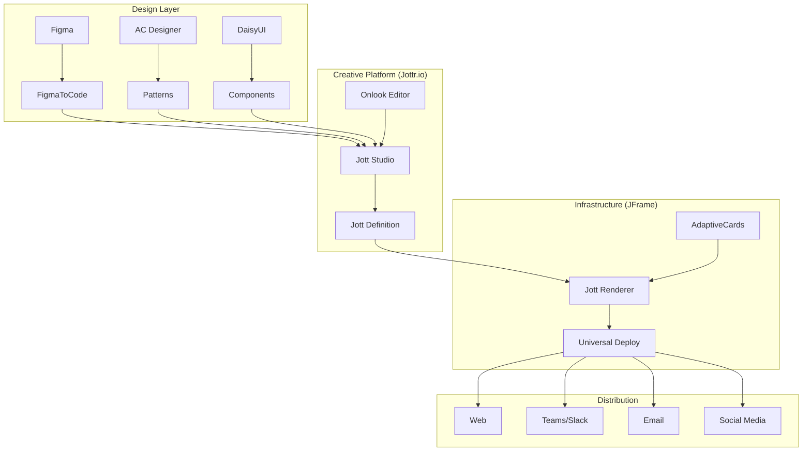

# Strategic Blueprint: JFrame & Jottr.io Platform

## Executive Summary

This document addresses the two significant problems identified:
1. **Technology Integration**: Utilizing best-in-class open-source libraries while maintaining coherence
2. **Product Differentiation**: Creating a unique product leveraging **conciseness** and **extensibility** principles

## 1. Unified Technology Integration Strategy

### 1a. Core Technology Stack

#### Foundation Libraries (MIT Licensed)
- **Microsoft AdaptiveCards** (1.9k stars): Core rendering engine
- **DaisyUI** (34k stars): Component patterns and theming
- **Onlook** (22.7k stars): AI-powered visual editor
- **FigmaToCode** (4.5k stars): Design-to-code pipeline

#### Design Resources
- **Adaptive Cards Designer**: UX patterns and validation
- **Figma APIs**: Design system synchronization
- **Teams AI SDK**: Conversational interfaces

### 1b. Coherent Integration Architecture



### 1c. License Compliance & Open Source Strategy

#### Three-Tier Licensing Model

**Tier 1: Core Open Source (MIT License)**
- JFrame rendering engine
- Basic Jott schema
- Platform connectors
- Community templates
- **Purpose**: Build ecosystem and developer trust

**Tier 2: Enhanced Open Source (MIT with Attribution)**
- Advanced templates
- Design system components
- Integration adapters
- **Purpose**: Drive adoption while maintaining brand presence

**Tier 3: Commercial (Proprietary)**
- Jottr.io Studio Pro features
- Enterprise security features
- Advanced AI capabilities
- Analytics and monetization
- **Purpose**: Revenue generation

#### Compliance Matrix

| Component | Source License | Our Usage | Our License | Risk Level |
|-----------|---------------|-----------|-------------|------------|
| AdaptiveCards | MIT | Fork & Extend | MIT | ✅ Low |
| DaisyUI | MIT | Pattern Adoption | MIT | ✅ Low |
| Onlook | Apache 2.0 | Integration | Proprietary UI | ✅ Low |
| FigmaToCode | MIT | API Integration | MIT Adapter | ✅ Low |
| Figma API | Commercial | API Calls | N/A | ⚠️ Medium |

### 1d. Blue Ocean Innovation Strategy

#### Unique Value Propositions

**1. "Cognitive Jotts"** - Beyond Static Cards
- **Innovation**: AI-powered adaptive content that evolves based on context
- **Extension**: AdaptiveCards + AI reasoning layer
- **Moat**: Proprietary AI training on interaction patterns

**2. "Jott Chains"** - Narrative Threading
- **Innovation**: Connected sequences of Jotts forming stories
- **Extension**: Single cards → Connected experiences
- **Moat**: Patent-pending interaction model

**3. "Ambient Jotts"** - Context-Aware Delivery
- **Innovation**: Jotts that appear when/where most relevant
- **Extension**: Push model → Intelligent pull
- **Moat**: Behavioral learning algorithms

**4. "Jott Economies"** - Creator Monetization
- **Innovation**: Micro-transactions for premium Jotts
- **Extension**: Free content → Creator economy
- **Moat**: Built-in payment rails and rev-share

### 1e. Multi-Stakeholder Strategy

#### Microsoft Relationship Matrix

| Role | Our Approach | Risk Mitigation | Opportunity |
|------|--------------|-----------------|-------------|
| **Supplier** | Use AdaptiveCards core | Maintain compatibility | Official certification |
| **Competitor** | Differentiate beyond Teams | Focus on creators | Different market segment |
| **Partner** | Teams/Office integration | Revenue sharing model | Co-marketing |
| **Customer** | Enterprise Jott deployment | White-label options | Large contracts |
| **Community** | Contribute to AC spec | Open source contributions | Thought leadership |

#### Tailwind/Catalyst Strategy
- **Leverage**: Use for rapid development
- **Contribute**: Share Jott-specific components
- **Differentiate**: Custom design system layer

#### Figma Ecosystem Play
- **Plugin Development**: "Jott Designer" Figma plugin
- **Template Marketplace**: Figma Community presence
- **API Partnership**: Preferred integration status

## 2. Product Differentiation: Revolutionary Cognitive Companion

### 2a. Core Design Principles

#### Beyond Conciseness: Cognitive Adaptation
**"Every Jott reads your mind and respects your time"**

The evolution from simple conciseness to cognitive companionship:
- **Context-Aware**: Knows what you're working on
- **Time-Adaptive**: Expands/contracts based on available attention
- **Relationship-Smart**: Remembers every interaction
- **Voice-First**: "Jott now" activates your assistant
- **Predictive**: Ready before you need it

1. **Progressive Disclosure**
   - Level 1: Headline + Visual (3 seconds)
   - Level 2: Key points (5 seconds)
   - Level 3: Full context (on demand)

2. **Smart Summarization**
   ```javascript
   // Jott Conciseness Engine
   {
     "headline": "Q3 Revenue Up 47%",
     "visual": "📈",
     "keyPoints": [
       "• SaaS revenue doubled",
       "• New markets opened",
       "• Profit margins improved"
     ],
     "expandAction": "View full report →"
   }
   ```

3. **Cognitive Load Management**
   - Maximum 3 key points visible
   - Single primary action
   - Visual hierarchy enforcement

#### Extensibility Architecture

**"Start simple, scale infinitely"**

1. **Extension Points**
   ```typescript
   interface JottExtension {
     // User-triggered expansions
     onExpand?: () => ExpandedContent;

     // AI-powered continuations
     onContinue?: () => NextJott;

     // Related content discovery
     onExplore?: () => RelatedJotts[];

     // Interactive deepening
     onInteract?: (action: UserAction) => JottUpdate;
   }
   ```

2. **Continuation Patterns**
   - **Narrative**: "What happened next..."
   - **Analytical**: "Dive deeper into..."
   - **Lateral**: "Related insights..."
   - **Temporal**: "Previous/Next in series..."

### 2b. User Experience Innovation

#### For Jotters (Creators)

**"Create in 30 seconds, monetize in 30 days"**

1. **Speed Tools**
   - Voice-to-Jott creation
   - Screenshot-to-Jott converter
   - Data-to-Jott automation
   - Template quick-starts

2. **Growth Tools**
   - Audience analytics
   - A/B testing framework
   - SEO optimization
   - Cross-platform scheduling

#### For Jottees (Consumers)

**"Never miss what matters, never waste time"**

1. **Intelligent Consumption**
   - Priority-based delivery
   - Context-aware timing
   - Personalized summaries
   - Smart notifications

2. **Interaction Modes**
   - **Skim Mode**: 3-second headlines only
   - **Browse Mode**: 7-second summaries
   - **Deep Mode**: Full expansions
   - **Journey Mode**: Connected narratives

### 2c. Technical Implementation

#### Conciseness Engine
```typescript
class ConcisenessEngine {
  // Intelligent summarization
  summarize(content: RichContent): ConciseJott {
    return {
      headline: this.extractHeadline(content),
      visual: this.selectVisual(content),
      keyPoints: this.identifyKeyPoints(content, max: 3),
      metadata: this.preserveContext(content)
    };
  }

  // Progressive revelation
  reveal(jott: ConciseJott, level: number): ExpandedContent {
    switch(level) {
      case 1: return jott.headline;
      case 2: return jott.keyPoints;
      case 3: return jott.fullContent;
      default: return jott.relatedContent;
    }
  }
}
```

#### Extensibility Framework
```typescript
class ExtensibilityFramework {
  // Dynamic extension loading
  loadExtensions(jott: Jott): Extension[] {
    return [
      this.aiExtensions(jott),      // AI-powered continuations
      this.dataExtensions(jott),     // Live data connections
      this.socialExtensions(jott),   // Social interactions
      this.commerceExtensions(jott)  // Transaction capabilities
    ];
  }

  // Smart continuation
  continue(jott: Jott, context: Context): NextJott {
    const userIntent = this.inferIntent(context);
    const continuation = this.generateContinuation(jott, userIntent);
    return this.optimizeForEngagement(continuation);
  }
}
```

## 3. Go-to-Market Strategy

### Phase 1: Developer Foundation (Months 1-3)
- Open source JFrame core
- Developer documentation
- Community templates
- GitHub presence building

### Phase 2: Creator Launch (Months 4-6)
- Jottr.io beta launch
- Onboard 100 pilot creators
- Template marketplace
- Creator monetization tools

### Phase 3: Platform Integration (Months 7-9)
- Teams/Slack apps
- Email integrations
- WordPress plugin
- Social media adapters

### Phase 4: Scale & Monetize (Months 10-12)
- Enterprise offerings
- Premium creator tools
- API marketplace
- White-label solutions

## 4. Success Metrics

### Technical KPIs
- Render time < 100ms
- Creation time < 30 seconds
- Cross-platform compatibility > 95%
- API uptime > 99.9%

### Business KPIs
- 10,000 active creators (Year 1)
- 1M Jotts created monthly
- 10% creator monetization rate
- $1M ARR from enterprise

### Ecosystem KPIs
- 1,000 GitHub stars
- 100 community contributors
- 50 third-party integrations
- 5 strategic partnerships

## 5. Risk Management

### Technical Risks
- **Platform changes**: Maintain abstraction layers
- **Performance issues**: Progressive enhancement
- **Security vulnerabilities**: Regular audits

### Business Risks
- **Microsoft competition**: Focus on creator economy
- **Market adoption**: Free tier + viral features
- **Monetization challenges**: Multiple revenue streams

### Legal Risks
- **License violations**: Regular compliance audits
- **Patent infringement**: Prior art research
- **Data privacy**: GDPR/CCPA compliance

## Conclusion

By combining best-in-class open source technologies with our unique principles of **conciseness** and **extensibility**, we create a blue ocean opportunity in the interactive content space. Our dual approach—open source infrastructure (JFrame) and commercial creative platform (Jottr.io)—ensures both ecosystem growth and revenue generation while respecting and leveraging our complex stakeholder relationships.

## Addenda
1. Utilize visual amplification: graphics, design, images, video, drawings, "infographics on the fly", sequenced rendering for carousel or slider, multiple card frame layouts for heroes, lists, grids, etc., plug-in frame combinations for dashboards, D3 & mermaid support, AI + manual editing in a chat with graphics (at least in composer), easy way to add pull quotes, graphics, charts, and diagrams to Substack, emails, teams chats, etc. 
