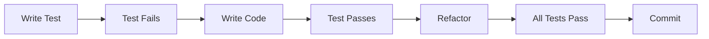

# Testing & Git Workflow Strategy

## Current State Audit

### ⚠️ Testing Infrastructure: **NONE FOUND**
- No test files (*.test.*, *.spec.*)
- No test framework installed
- No package.json in root (static site)
- jottr-io has React but no tests yet

### ✅ Git Setup: **PROPERLY CONFIGURED**
- User: neurodance
- Email: GitHub no-reply address (privacy maintained)
- SSH signing key configured
- Default branch: main
- Copilot branch exists (PR workflow active)

## Testing Strategy

### 1. Immediate Testing Setup (Sprint 1)

#### For JFrame (Static Site)
```javascript
// testing/setup.js
const chrome_devtools_mcp = require('../chrome-devtools-mcp');

// Test configuration
module.exports = {
  testAdaptiveCardRendering: async (cardJson) => {
    // Use chrome-devtools-mcp for browser testing
    const browser = await chrome_devtools_mcp.launch();
    const page = await browser.newPage();
    await page.goto('file:///index.html');
    await page.evaluate(card => renderCard(card), cardJson);
    const screenshot = await page.screenshot();
    await browser.close();
    return screenshot;
  }
};
```

#### For Jottr.io (React App)
```json
// jottr-io/package.json additions
{
  "scripts": {
    "test": "vitest",
    "test:ui": "vitest --ui",
    "test:coverage": "vitest --coverage"
  },
  "devDependencies": {
    "@testing-library/react": "^14.0.0",
    "@testing-library/jest-dom": "^6.0.0",
    "vitest": "^1.0.0",
    "@vitest/ui": "^1.0.0"
  }
}
```

### 2. Test Categories & Coverage Targets

#### Unit Tests (Target: 80% coverage)
- **JFrame Core**:
  - Card rendering functions
  - Schema validation
  - API key management
  - Template selection logic

- **Jottr.io Components**:
  - React components
  - State management
  - Form validation
  - Data transformations

#### Integration Tests (Using chrome-devtools-mcp)
- Cross-browser rendering
- Mobile responsive tests
- Performance benchmarks (<100ms render)
- Accessibility compliance

#### Visual Regression Tests
```javascript
// visual-tests/regression.js
const scenarios = [
  { name: 'weather-card', viewport: 'mobile' },
  { name: 'product-card', viewport: 'desktop' },
  { name: 'video-jott', viewport: 'tablet' }
];

scenarios.forEach(async (scenario) => {
  await chrome_devtools_mcp.captureScreenshot(scenario);
  await chrome_devtools_mcp.compareWithBaseline(scenario);
});
```

### 3. Test-Driven Development Workflow



## Git Workflow & Maintenance

### 1. Branch Strategy

```bash
main                 # Production-ready code
├── develop         # Integration branch
├── feature/*       # New features
├── fix/*          # Bug fixes
├── test/*         # Test improvements
└── release/*      # Release preparation
```

### 2. Commit Standards

#### Commit Message Format
```
<type>(<scope>): <subject>

<body>

<footer>
```

#### Types
- **feat**: New feature
- **fix**: Bug fix
- **test**: Testing improvements
- **docs**: Documentation
- **style**: Code style (no logic change)
- **refactor**: Code restructuring
- **perf**: Performance improvements
- **chore**: Maintenance tasks

#### Examples
```bash
# Good commits
git commit -m "feat(jframe): add video support to AdaptiveCards"
git commit -m "test(jottr-io): add unit tests for card editor"
git commit -m "fix(mobile): resolve camera permission issue"

# Bad commits (avoid these)
git commit -m "fixed stuff"
git commit -m "WIP"
git commit -m "updates"
```

### 3. Pre-commit Hooks

Create `.husky/pre-commit`:
```bash
#!/bin/sh
# Run tests before commit
npm test || exit 1

# Check code formatting
npm run lint || exit 1

# Ensure no console.logs in production
grep -r "console.log" src/ && echo "Remove console.logs!" && exit 1

echo "✅ Pre-commit checks passed"
```

### 4. Pull Request Process

#### PR Checklist
- [ ] Tests written and passing
- [ ] Code coverage maintained/improved
- [ ] Visual regression tests updated
- [ ] Documentation updated
- [ ] No merge conflicts
- [ ] Performance benchmarks met

#### PR Template (.github/pull_request_template.md)
```markdown
## Description
Brief description of changes

## Type of Change
- [ ] Bug fix
- [ ] New feature
- [ ] Breaking change
- [ ] Documentation update

## Testing
- [ ] Unit tests pass
- [ ] Integration tests pass
- [ ] Visual tests updated
- [ ] Manual testing completed

## Screenshots (if UI changes)
[Add screenshots]

## Performance Impact
- Render time: XX ms
- Bundle size: XX KB
```

### 5. Release Process

```bash
# 1. Create release branch
git checkout -b release/v1.0.0

# 2. Run full test suite
npm run test:all

# 3. Update version
npm version minor

# 4. Generate changelog
npm run changelog

# 5. Create PR to main
gh pr create --title "Release v1.0.0" --body "$(cat CHANGELOG.md)"

# 6. After merge, tag release
git tag -a v1.0.0 -m "Release version 1.0.0"
git push origin v1.0.0
```

## Implementation Timeline

### Week 1 (Immediate)
1. **Day 1**: Set up chrome-devtools-mcp testing
2. **Day 2**: Create first unit tests for core functions
3. **Day 3**: Add pre-commit hooks
4. **Day 4**: Implement visual regression testing
5. **Day 5**: Document testing procedures

### Week 2
1. Set up CI/CD with GitHub Actions
2. Add coverage reporting
3. Create PR templates
4. Implement branch protection rules

### Week 3
1. Full test suite for existing code
2. Performance benchmarking
3. Accessibility testing
4. Cross-browser testing matrix

## GitHub Actions CI/CD

Create `.github/workflows/test.yml`:
```yaml
name: Test Suite

on:
  pull_request:
    branches: [main, develop]
  push:
    branches: [main]

jobs:
  test:
    runs-on: ubuntu-latest

    steps:
    - uses: actions/checkout@v3

    - name: Setup Node
      uses: actions/setup-node@v3
      with:
        node-version: '20'

    - name: Install dependencies
      run: npm ci

    - name: Run unit tests
      run: npm test

    - name: Run integration tests
      run: npm run test:integration

    - name: Check coverage
      run: npm run test:coverage

    - name: Upload coverage
      uses: codecov/codecov-action@v3

    - name: Visual regression tests
      run: npm run test:visual

    - name: Performance tests
      run: npm run test:performance
```

## Monitoring & Metrics

### Test Metrics to Track
- Code coverage percentage
- Test execution time
- Number of tests
- Test failure rate
- Performance benchmarks

### Git Metrics to Track
- Commit frequency
- PR review time
- Merge conflict rate
- Branch lifetime
- Release cycle time

## Best Practices

### Testing
1. **Write tests first** (TDD)
2. **One assertion per test**
3. **Descriptive test names**
4. **Mock external dependencies**
5. **Test edge cases**

### Git
1. **Commit early and often**
2. **Keep commits atomic**
3. **Write meaningful messages**
4. **Review your own PR first**
5. **Keep branches short-lived**

## Conclusion

Current state shows **strong git practices** but **zero testing infrastructure**. Immediate priority is leveraging chrome-devtools-mcp for comprehensive testing while maintaining good git hygiene. This strategy ensures quality and maintainability as the project scales.